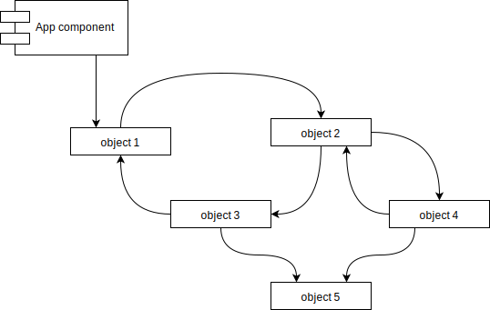
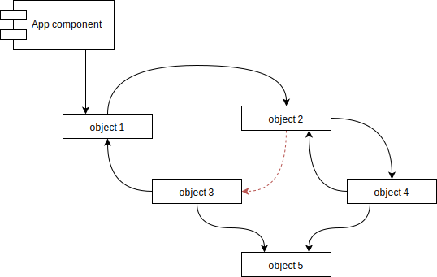
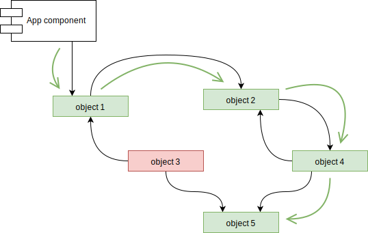
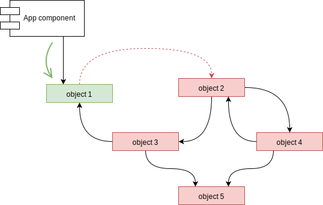

# Deferred heap

Deferred heap is a library providing deferred memory management 
for C++17 application. 
It is a helper for local memory management for cases when objects 
are referencing each other in non-hierarchical way with possible 
cycles of references. Also features deferred (delayed & unordered) 
destruction and deletion.

## Getting Started

So far library source should be downloaded and compiled with a project.
Library source root contains CMakeLists.txt and could be included
by your project's cmake.

### Compiling

Library require C++17 support to be compiled.

## Use case example

Typical example is when there is a graph-like structure with
objects pointing to each other in non-hierarchical way,
where cycles of references can occur. While there are ways 
to deal with such structures, frequent new allocations and 
pointers invalidation may lead to much effort from software 
developer to destroy object not needed anymore.

### Problem

Suppose you have following objects structure:



There is *"App component"* object that point to *"object 1"*, 
that itself point to other objects in graph-like manner.
You can see already that there are two cycles of references:

* *"object 1"* -> *"object 2"* -> *"object 3"* -> *"object 1"*
* *"object 2"* -> *"object 4"* -> *"object 2"*


Lets see if *"object 2"* -> *"object 3"* reference disappears:



Now *"object 3"* is no longer reachable from *"App component"*, 
as there is no way to get to it, considering there are no more 
pointers from outside of this setup.



You can note that in this example there are no pointer 
that points to *"object 3"*, so you might suggest using 
std::shared_ptr to delete *"object 3"* automatically.
But consider following scenario - 
*"object 1"* -> *"object 2"* reference disappears:



Now every object, except *"object 1"* is unreachable 
and should be deleted, but would not be. This is because 
there is pointer still pointing to every object, due to
existence of cycle of references. Such objects will never be
deleted using std::shared_ptr, std::unique_ptr or other
kind of "owning" or "reference counting" smart pointers.

The only way to solve this problem in automatic manner is to
use object reachability algorithm (or tracing collector). 
This library is a framework to enable such collector for
your classes and relations.

## Running the tests

By default tests are not compiled and exported. 
To enable deferred heap library tests, DEFERRED_HEAP_BUILD_TEST=ON 
option should be specified to cmake. 
"DeferredHeapTest" target build tests, 
"test" target build and execute tests.

```
cmake -DDEFERRED_HEAP_BUILD_TEST=ON path_to_library
cmake --build build_path --target test
```

## Versioning

Project use [SemVer](http://semver.org/) for versioning. 
For the versions available, see the 
[releases](https://github.com/JohnJocoo/deferred_heap/releases). 

## Authors

* **Anton Frolov** - *Creator, maintainer* - 
[GitHub](https://github.com/JohnJocoo), 
[email](mailto:johnjocoo@gmail.com)

## License

This project is licensed under the Boost Software License 1.0 - 
see the [LICENSE.md](LICENSE.md) file for details

## Acknowledgments

* [This great talk by Herb Sutter](https://youtu.be/JfmTagWcqoE?t=2489) 
with his implementation of deferred heap on 
[GitHub](https://github.com/hsutter/gcpp). 
It has more advance approach, that sadly imply more runtime costs.
It was my original inspiration for this more simple and 
utilitarian library.
